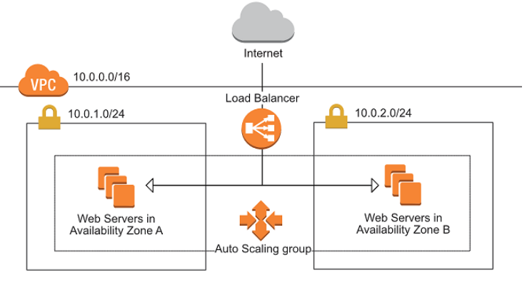

# Application Load Balancer HTTP
---
### alb-http

The purpose of this lab is deploying a simple Public Application Load Balancer across the provided public subnets.
This Application Load Balance is only for HTTP (Port 80).

Besides, this lab will provision the EC2 instances behind of the Auto Scaling Group, using launch templates within Target Group configuration.
There are two Ec2 instances running on each Availability Zone (for High Availability).

### ALB Prerequisites

- 1 VPC
  - 2 public subnets in different AZs
  - Route table attached to IGW
  - 2 Security groups:
    - SG for ALB
    - SG for EC2
- ASG EC2
  - Launch template
  - Target Group (2 Ec2 Instances)
- ALB

---

### **Note:** *This lab does not involve SSL configuration (for http study only).*

