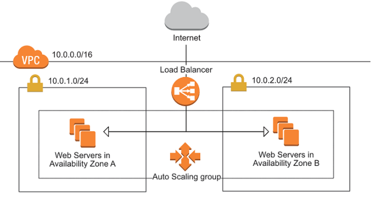

# Application Load Balancer
---
### ALB

The purpose of this lab is deploying a Public Application Load Balancer across the provided public subnet.

Besides, this lab will provision the EC2 instances behind of the Auto Scaling Group, using launch templates within Target Group configuration.

### ALB Prerequisites

- 1 VPC
  - 2 public subnets in different AZs
  - Route table attached to IGW
  - 2 Security groups:
    - SG for ALB
    - SG for EC2
- ASG EC2
  - Launch template
  - Target Group
- ALB

